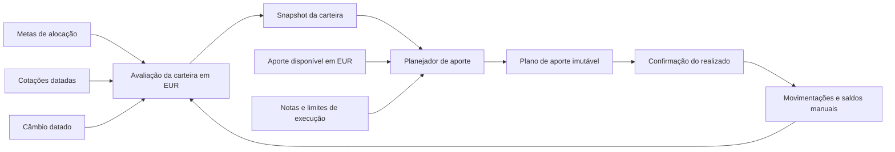

# Plano técnico — módulo de investimentos

**Status:** implementado — pronto para teste pessoal controlado em produção

**Data:** 11 de agosto de 2026

**Escopo:** carteira pessoal, cinco categorias-alvo, avaliação multimoeda em EUR e planejamento de novos aportes sem execução de ordens.

## Resultado esperado

O sistema passará a manter uma carteira longitudinal, independente dos meses do orçamento, com:

- Stocks;
- REITs;
- Renda Fixa Brasil;
- Renda Fixa Internacional;
- Criptomoedas, somente como meta percentual, sem instrumentos ou saldo nesta versão;
- metas por classe que totalizam exatamente 100%;
- quantidades fracionárias para ativos negociados em mercado;
- saldos informados manualmente para renda fixa;
- último fechamento disponível e câmbio diário armazenados como snapshots;
- patrimônio consolidado e sugestões em EUR;
- planos de aporte reproduzíveis e explicáveis;
- registro posterior do que foi realmente executado.

O módulo orienta e registra. Ele não envia ordens a corretoras e não promete cotação em tempo real.

## Decisões adotadas para o MVP

| Tema | Decisão |
|---|---|
| Carteira | Uma carteira global, coerente com o login single-user atual. |
| Relação com mês | Independente de `Month`; investimentos não são clonados nem fechados na virada mensal. |
| Moeda base | EUR para avaliação, cálculo do aporte e apresentação consolidada. |
| Classes | Cinco categorias-alvo. Stocks, REITs e as duas rendas fixas aceitam instrumentos; Criptomoedas é apenas meta percentual. ETF/ADR é uma espécie de instrumento dentro de Stocks, não uma nova classe. |
| Precisão das metas | Percentuais inteiros de 0% a 100%, informados somente pelos sliders, e soma exata de 100%. |
| Moeda do instrumento | Informada/confirmada pelo provedor; nunca inferida pela classe ou apenas pelo ticker. |
| Renda fixa | Valor atual de resgate informado manualmente, com moeda e data. |
| Stocks/REITs | Quantidade derivada das movimentações; cotação automática diária. |
| Nota | Inteiro não negativo que define peso relativo dentro de Stocks ou REITs; nota zero exclui o instrumento do aporte. |
| Rebalanceamento | Apenas com dinheiro novo; não há sugestão automática de venda. |
| “Mais barato” | Significa mais abaixo do peso desejado após a cotação atual, não menor preço nominal nem preço abaixo do custo médio. |
| Plano versus execução | Simular não altera a carteira. O usuário confirma posteriormente preço, quantidade e taxas efetivamente executados. |
| Dados externos | Último fechamento disponível, uma coleta diária, fonte e data sempre visíveis. |
| Frações | Passo configurável por instrumento/corretora; padrão inicial de `0,000001`, sempre arredondado para baixo. |

Se o produto deixar de ser estritamente pessoal, `User`/`OwnerId` precisa ser introduzido antes de popular carteiras de outras pessoas.

## Limite do “Diagrama do Cerrado”

As páginas públicas da ferramenta confirmam o fluxo Ativos → Metas → Novo Aporte e informam que somente ativos com nota maior que zero participam do cálculo. Elas não publicam a fórmula completa. A própria AUVP descreve o Diagrama como ferramenta exclusiva de rebalanceamento. Fontes: [ferramenta oficial](https://ferramentas.auvp.com.br/carteira) e [descrição oficial](https://www.aulasauvp.com.br/course/analisedesetores).

Por isso, o produto deve chamar a implementação de **estratégia de alocação por nota** e ter uma fórmula própria, determinística e testável. Não deve copiar o questionário, a marca ou o layout da ferramenta. As screenshots servem como referência de fluxo e hierarquia da informação.

## Fluxo do domínio



## Modelo de domínio

### Carteira e metas

- `InvestmentPortfolio`
  - moeda base `EUR`;
  - versão de concorrência;
  - data da última alteração.
- `AllocationTarget`
  - classe de ativo;
  - peso entre zero e um;
  - unique por carteira e classe.
- Invariantes:
  - as cinco categorias aparecem uma única vez;
  - a soma é exatamente `1,00000000`;
  - cada peso representa um percentual inteiro (`peso × 100` sem fração);
  - atualização completa e atômica;
  - nenhum plano anterior continua válido depois de mudar as metas.
- `CRYPTOCURRENCIES` não pode ser usada no cadastro de instrumentos, movimentações, cotações ou avaliações manuais.

### Instrumento e posição

- `InvestmentInstrument`
  - classe estratégica;
  - espécie: ação, ETF, ADR, REIT, título ou conta;
  - nome e identificador público;
  - ticker, MIC/bolsa e ISIN quando existirem;
  - moeda nativa;
  - modo de avaliação: `MARKET_QUOTE` ou `MANUAL`;
  - nota de alocação;
  - passo mínimo de quantidade;
  - ativo/arquivado.
- Ticker não é identificador. `ITUB` pode representar instrumentos diferentes, e `VWRA` muda de convenção entre provedores.
- Instrumentos com histórico são arquivados, não apagados fisicamente.

### Movimentações

- `InvestmentTransaction`
  - `OPENING_BALANCE`, `BUY`, `SELL`, `DEPOSIT`, `WITHDRAWAL` ou `ADJUSTMENT`;
  - data;
  - quantidade, preço unitário e moeda quando aplicáveis;
  - taxas;
  - câmbio histórico para EUR;
  - chave de idempotência.
- A quantidade e o custo médio são projeções do histórico, evitando dois valores autoritativos divergentes.
- No cadastro de uma posição já existente, uma movimentação de abertura aceita quantidade e custo opcional. Sem custo conhecido, o valor atual funciona, mas custo médio e ganho/perda aparecem como indisponíveis.

### Avaliação manual

- `ManualValuation`
  - saldo total resgatável;
  - moeda;
  - data de referência;
  - data de registro.
- Atualizar renda fixa cria um snapshot; não sobrescreve o histórico.
- Depósitos/retiradas e valorização são conceitos diferentes: a movimentação mede fluxo; a avaliação manual mede valor atual.
- Entre duas avaliações manuais, o valor corrente estimado é o último snapshot mais depósitos e menos retiradas posteriores. Juros e marcação só aparecem quando o usuário informa um novo saldo.

### Dados de mercado

- `MarketQuoteSnapshot`
  - instrumento e mapeamento do provedor;
  - fechamento não ajustado ou último valor disponível;
  - moeda e escala;
  - `asOf`, `fetchedAt`, fonte e indicação de fallback.
- `FxRateSnapshot`
  - convenção única: `1 EUR = rate moeda_cotada`;
  - par, taxa, `asOf`, `fetchedAt`, fonte e fallback.
- Nunca representar dado ausente com preço zero.
- Um plano referencia os IDs exatos de cotações e câmbio usados.

### Plano de aporte

- `ContributionPlan`
  - valor disponível em EUR;
  - versão da carteira e da estratégia;
  - data de criação e expiração;
  - total sugerido e caixa residual;
  - status `DRAFT`, `CONFIRMED`, `EXPIRED` ou `CANCELLED`.
- `ContributionPlanLine`
  - classe e instrumento opcional;
  - valor antes, meta e desvio;
  - valor recomendado em EUR e na moeda nativa;
  - quantidade sugerida;
  - score, explicação e snapshots usados.

## Regra de avaliação multimoeda

Todas as contas usam `decimal`; o arredondamento monetário ocorre apenas na apresentação ou na criação da quantidade executável.

Para um instrumento negociado:

```text
valor_nativo = quantidade × último_preço
valor_eur    = valor_nativo / taxa_da_moeda_por_eur
```

Exemplo: se `1 EUR = 1,17 USD`, então `117 USD = 100 EUR`.

Para renda fixa, `valor_nativo` é o último saldo manual. EUR → USD → EUR não será usado: uma conversão intermediária aumenta erro e dificulta auditoria sem alterar os pesos relativos.

O snapshot consolidado traz por linha:

- valor nativo e moeda;
- valor em EUR;
- preço e câmbio usados;
- data de cada fonte;
- indicador de dado desatualizado;
- total EUR;
- peso atual por classe e instrumento.

## Algoritmo de aporte

O cálculo fica em um módulo puro e profundo:

```text
ContributionAllocator.Calculate(
    PortfolioSnapshot,
    ContributionAmount,
    AllocationPolicy,
    ExecutionConstraints
) -> ContributionPlan
```

### 1. Distribuição entre as cinco categorias-alvo

Considere:

```text
P   = patrimônio atual em EUR
A   = aporte disponível em EUR
V_i = valor atual da classe i
t_i = peso alvo da classe i
T_i = t_i × (P + A)
g_i = T_i - V_i
```

O aporte por classe `x_i` é a projeção dos gaps sobre o conjunto `x_i >= 0` e `soma(x_i) = A`:

```text
x_i = max(0, g_i - τ)
```

`τ` é escolhido para que a soma seja exatamente o aporte. Isso minimiza:

```text
soma(((V_i + x_i) / (P + A) - t_i)²)
```

Logo, o resultado é a carteira pós-aporte mais próxima das metas em pontos percentuais, sujeita a duas regras: não vender e não gastar mais que o aporte.

Criptomoedas participa dessa projeção macro para tornar visível o gap da meta, mas é **target-only** nesta versão. Qualquer parcela planejada para ela permanece como residual explícito e não gera instrumento, cotação, saldo ou linha executável de compra.

Exemplo:

| Classe | Atual | Meta | Meta após aporte de €1.000 | Gap |
|---|---:|---:|---:|---:|
| Stocks | €3.500 | 40% | €4.400 | €900 |
| REITs | €700 | 10% | €1.100 | €400 |
| RF Brasil | €3.800 | 30% | €3.300 | -€500 |
| RF Internacional | €2.000 | 20% | €2.200 | €200 |

Com patrimônio inicial de €10.000, a projeção sugere aproximadamente:

- Stocks: €733,33;
- REITs: €233,33;
- RF Brasil: €0;
- RF Internacional: €33,34.

A classe já acima da meta não recebe dinheiro novo; as demais terminam com o mesmo desvio absoluto possível em relação aos seus alvos.

### 2. Distribuição interna de Stocks e REITs

Para cada classe de mercado:

```text
w_j = nota_j / soma_das_notas_positivas_da_classe
C   = valor_atual_da_classe + aporte_destinado_à_classe
G_j = w_j × C - valor_atual_do_instrumento_j
```

Aplica-se a mesma projeção sobre simplex aos `G_j`, usando como total o aporte da classe. Consequências:

- notas iguais produzem pesos internos iguais;
- uma nota maior permite exposição relativa maior;
- nota zero não recebe aporte;
- uma posição que caiu tende a ficar mais abaixo do peso e recebe mais do próximo aporte;
- uma posição que subiu e ficou acima do peso pode receber zero;
- o custo médio não altera a recomendação;
- preços nominais de empresas diferentes nunca são comparados como medida de “barato”.

Esse mecanismo já produz o efeito de DCA/contrafluxo desejado sem inventar uma noção de preço justo. Uma camada futura de valuation fundamental só deve ser adicionada com métricas explícitas e influência limitada.

Se não houver instrumento elegível dentro da classe, o valor fica como residual não alocado e a tela explica o motivo; ele não é silenciosamente desviado para outra classe.

Para Renda Fixa Brasil e Renda Fixa Internacional, o planejador encerra no valor da classe. Se houver um único instrumento ativo ele pode ser pré-selecionado; com vários, o usuário escolhe o destino e confirma o novo saldo. O MVP não inventa uma distribuição interna automática para renda fixa.

### 3. Quantidade fracionária e residual

Para um instrumento cotado em USD:

```text
valor_usd_disponível = recomendação_eur × usd_por_eur
quantidade_bruta     = valor_usd_disponível / preço_usd
quantidade_sugerida  = floor(quantidade_bruta / step) × step
```

O mesmo vale para qualquer moeda. Depois do arredondamento:

1. recalcular o valor efetivamente consumido;
2. tentar aplicar o residual ao maior gap remanescente quando um incremento completo couber;
3. manter o restante como caixa residual;
4. garantir `soma(recomendações) + residual <= aporte`.

O MVP não estima spread, imposto ou comissão. O preview deixa essa premissa visível e a confirmação registra os valores reais.

### 4. Determinismo e validade

- Empates usam ordem estável por classe, MIC e símbolo/ID.
- A versão do algoritmo é persistida no plano.
- Qualquer mudança de meta, posição ou avaliação manual expira previews abertos.
- Novo snapshot de mercado não reescreve um plano antigo.
- A confirmação é idempotente e aceita valores realizados diferentes do preview.

## Persistência proposta

| Tabela | Finalidade | Precisão/constraints principais |
|---|---|---|
| `investment_portfolios` | Moeda base e versão | uma carteira no MVP; `base_currency char(3)` |
| `investment_allocation_targets` | Cinco metas | `numeric(9,8)`; unique classe; `0..1`; novos saves aceitam apenas percentuais inteiros |
| `investment_instruments` | Catálogo e regra de avaliação | unique por identidade normalizada; soft delete |
| `market_instrument_mappings` | Símbolo por provedor | unique instrumento + provedor; moeda e multiplicador explícitos |
| `investment_transactions` | Quantidade, custo e fluxos | quantidade `numeric(24,12)`; preço `numeric(20,8)` |
| `investment_manual_valuations` | Saldos históricos de renda fixa | valor `numeric(20,8)`; moeda e data |
| `market_quote_snapshots` | Cache/snapshot de preços | preço `numeric(24,12)`; revisões append-only por instrumento, fonte e data |
| `fx_rate_snapshots` | Cache/snapshot de câmbio | taxa `numeric(24,12)`; revisões append-only por par, fonte e data |
| `investment_contribution_plans` | Preview auditável | versão, expiração, status e idempotência |
| `investment_contribution_plan_lines` | Recomendações congeladas | valores, unidades, explicação e snapshot IDs |

Configurações EF devem ficar em `Infrastructure/Persistence/Configurations/Investments`, em vez de aumentar ainda mais o método único atual.

A migração é aditiva e não altera meses, orçamentos ou lançamentos. Carteiras existentes recebem `CRYPTOCURRENCIES = 0%` sem alterar os quatro pesos anteriores; a versão da carteira é incrementada para invalidar previews antigos. O onboarding exige as cinco metas e não aplica outro percentual padrão arbitrário.

## Backend

### Módulos

- `PortfolioManagement`
  - configurar metas atomicamente;
  - cadastrar/arquivar instrumentos;
  - registrar movimentações e avaliações manuais.
- `PortfolioValuation`
  - selecionar os snapshots corretos;
  - converter para EUR;
  - calcular quantidade, custo, valor e frescor.
- `ContributionPlanning`
  - gerar e confirmar planos por meio de `ContributionAllocator`.
- `MarketDataRefresh`
  - resolver símbolos;
  - coletar em lote;
  - validar identidade/moeda/escala;
  - persistir snapshots e aplicar fallback.

O código mantém o padrão atual de controllers finos e `ICostTrackerDbContext`; não é necessário criar um repositório superficial por tabela.

### Seams externas

```csharp
IMarketQuoteProvider.GetQuotesAsync(instruments, asOf, cancellationToken)
IExchangeRateProvider.GetRatesAsync(currencies, asOf, cancellationToken)
```

Adapters HTTP de produção e adapters fake de teste ocupam esses seams. O cálculo puro não conhece JSON, API keys ou nomes de provedor. `TimeProvider` é injetado para testar agenda, cache e expiração.

### Endpoints propostos

```text
GET  /api/investments/portfolio
PUT  /api/investments/allocation

GET  /api/investments/instruments
POST /api/investments/instruments
PUT  /api/investments/instruments/{id}
POST /api/investments/instruments/{id}/archive

GET  /api/investments/instruments/{id}/transactions
POST /api/investments/instruments/{id}/transactions
POST /api/investments/instruments/{id}/manual-valuations

GET  /api/investments/market-data/status
POST /api/investments/market-data/refresh

POST /api/investments/contribution-plans
GET  /api/investments/contribution-plans/{id}
POST /api/investments/contribution-plans/{id}/confirm
```

## Entrega e validação final

As seis etapas foram implementadas: fundação da carteira, histórico e saldos,
market data/FX, motor de aporte, confirmação auditável e hardening operacional.

Validação concluída em 11 de agosto de 2026:

- 58 testes backend aprovados;
- 26 testes frontend aprovados e bundle de produção gerado;
- modelo EF sem alterações pendentes;
- seis migrações aplicadas do zero em PostgreSQL 16 real;
- migração de Criptomoedas validada sobre carteira legada com quatro metas,
  incluindo bump de versão e rollback que preserva a soma de 100%;
- smoke HTTP completo com Npgsql: onboarding, USD/BRL/EUR, cotação manual,
  refresh ECB, valuation, preview, confirmação e idempotência;
- backup de produção testado e validado com `gzip -t`;
- GBP/GBX, dados futuros, valuation parcial, frescor e posições com nota zero
  cobertos por regras e testes.

Para o teste pessoal, Yahoo permanece um fallback explícito e sem SLA. Twelve
Data e Marketstack podem ser habilitados por chave; Marketstack só é consultado
quando existe mapping explícito, pois sua resposta EOD não confirma a unidade da
moeda. A tela permite registrar uma cotação manual quando os provedores falham.

Respostas financeiras sempre carregam `amount`, `currency`, `asOf`, fonte e estado de frescor. Falha externa vira `503 Problem Details`, não `409` genérico.

## Provedores externos

A pesquisa completa está em [market-data-providers.md](../research/market-data-providers.md).

### Composição recomendada

- **Cotações pessoais:** Twelve Data Grow como primário; cobre EOD global. A faixa Basic gratuita cobre os EUA, mas somente símbolos internacionais de teste.
- **Fallback EOD:** Marketstack Basic, condicionado a preflight dos instrumentos e confirmação da licença aplicável.
- **Câmbio primário:** ECB Data Portal, sem chave, com USD e BRL publicados contra EUR.
- **Câmbio de contingência:** PTAX do Banco Central do Brasil.
- **Modo estritamente gratuito/pessoal:** Alpha Vantage pode ser adapter inicial com limite conservador de 25 chamadas/dia e entrada manual para símbolos não cobertos, mas as páginas oficiais têm informação conflitante de limite e o uso comercial precisa de acordo.

Não existe uma opção gratuita que seja simultaneamente confiável, global, estável e claramente licenciada para exibição comercial. O provider deve permanecer configurável.

### Coleta diária

- agenda inicial: 06:00 `Europe/Lisbon`, quando os fechamentos do dia anterior de LSE/EUA e o câmbio ECB já devem estar disponíveis;
- catch-up no startup quando ainda não existir snapshot para a última sessão esperada;
- uma chamada em lote sempre que o provedor permitir;
- timeout curto e retry apenas para falhas transitórias;
- fallback somente por indisponibilidade, quota ou ausência de dado — nunca para escolher o menor preço;
- diferença superior a 3%, MIC/moeda divergente ou escala diferente gera alerta;
- unique constraints e, se houver mais de uma réplica, lock consultivo no PostgreSQL tornam o refresh idempotente;
- API key apenas no backend e em variável de ambiente;
- o provedor recebe símbolos, nunca quantidades, custo ou patrimônio.

### Política de frescor

- mercado/FX: avisar depois de uma sessão esperada sem atualização; bloquear novo plano depois de duas sessões, salvo override explícito e auditado;
- saldo manual: avisar após 7 dias; bloquear depois de 31 dias, salvo override;
- fim de semana e feriado são avaliados por sessões, não por horas corridas;
- UI usa “último fechamento disponível”, nunca “preço agora”.

## Frontend

### Ajuste estrutural

O `Layout` atual sempre mostra mês, salário, comprometido e executado. A carteira é longitudinal. O shell deve ser separado em:

- `AppChrome`: marca, navegação, privacidade, tema e logout;
- `MonthlyContextHeader`: seletor de mês e KPIs somente nas rotas mensais;
- `InvestmentsShell`: abas e ações próprias da carteira.

A rota será `/investimentos/*`, carregada de forma lazy. Na navegação móvel, oito itens já não cabem com qualidade; usar cinco destinos principais e um item “Mais”, mantendo todos visíveis no desktop.

### Estrutura da feature

```text
frontend/src/features/investments/
  api.ts
  types.ts
  queryKeys.ts
  schemas.ts
  constants.ts
  pages/
  components/
  investments.css
```

O cálculo financeiro permanece no backend. React Query mantém estado remoto; React Hook Form + Zod validam os formulários; não é necessário Redux/Zustand.

### Telas

1. **Onboarding/Alocação**
   - cinco sliders, sem campo numérico digitável;
   - precisão inteira, em passos de 1 ponto percentual;
   - total em `aria-live` e salvar apenas em 100%;
   - donut e tabela textual “atual × meta × desvio”.
2. **Carteira**
   - patrimônio total EUR, custo conhecido, ganho/perda e data mais antiga do snapshot;
   - donut por classe;
   - filtros e lista de instrumentos;
   - valor nativo + equivalente EUR, quantidade/saldo, custo médio, preço, percentual e frescor.
3. **Cadastro/edição**
   - Stocks/REITs: busca e confirmação de instrumento/MIC, nota, quantidade inicial e custo opcional;
   - renda fixa: nome, moeda, saldo atual e data;
   - moedas confirmadas, nunca inferidas pelo tipo.
4. **Novo aporte**
   - informar EUR;
   - gerar preview imutável;
   - revisar macro e detalhes de Stocks/REITs;
   - exibir motivo, snapshots, valor nativo, frações e residual;
   - CTA “Registrar aporte”, não “Aportar”.
5. **Histórico/detalhe**
   - movimentações, avaliações manuais e planos anteriores;
   - custo médio e quanto foi aportado quando houver dados suficientes.

### Ajustes compartilhados

- trocar o formatter EUR fixo por `formatCurrency(value, currency)`;
- manter `PrivacyMask` em todos os valores;
- aproveitar Recharts e o vocabulário visual dos targets atuais;
- não reutilizar regras mensais do componente de metas;
- CSS da feature separado do arquivo global;
- desktop com tabela + gráfico lateral, tablet empilhado e mobile em cards;
- gráficos com resumo textual, filtros com `aria-pressed`, tabelas com `caption`/`aria-sort` e dialogs com focus trap.

As screenshots inspiram a organização, mas o módulo deve manter os temas e tokens atuais e eliminar os scrolls internos grandes mostrados nas referências.

## Segurança e operação

- Controllers continuam cobertos pelo filtro global de autenticação.
- Confirmar `UseForwardedHeaders` e cookie `Secure` no deploy atrás do Caddy.
- Adicionar proteção CSRF/antiforgery às mutações antes de tratar registros financeiros como sensíveis.
- API keys ficam apenas em secrets/variáveis de ambiente; nunca no Vite.
- Targets e confirmação usam controle otimista de concorrência.
- Refresh e confirmação são idempotentes.
- Métricas: sucesso do refresh, idade máxima do dado, uso do fallback, divergências e consumo de quota.
- Logs não contêm patrimônio, credenciais ou payloads com segredo.
- Snapshots antigos têm política de retenção definida; planos confirmados nunca perdem os snapshots referenciados.

No MVP, registrar um aporte não cria automaticamente um lançamento no orçamento mensal. Uma integração opcional com a categoria “Saving” pode ser desenhada depois, com vínculo explícito para evitar dupla contagem.

## Estratégia de testes

### Domínio

- metas exatamente 100%, soma abaixo/acima e classes duplicadas;
- carteira vazia;
- classe acima da meta não recebe aporte;
- aporte insuficiente para corrigir todos os desvios;
- conservação: sugestões + residual nunca excedem o aporte;
- determinismo em empates;
- notas iguais/diferentes/zero;
- queda de preço aumenta gap, mas preço nominal menor sozinho não vence;
- nenhum instrumento elegível;
- fração mínima e arredondamento para baixo;
- conversão identidade, direta e inversa;
- USD, BRL, EUR, GBP e GBX;
- missing/stale quote e FX;
- exemplos numéricos de aceitação congelados.

### Aplicação e providers

- targets atualizados atomicamente;
- um plano inteiro usa o mesmo conjunto de snapshots;
- cache diário e refresh concorrente;
- respostas parciais, `429`, timeout, 5xx e chave revogada;
- fallback sem misturar identidades;
- mudança de carteira expira preview;
- confirmação duplicada não duplica movimentações;
- saldo manual mais recente é selecionado corretamente.

### Persistência real

Os testes atuais usam EF InMemory e não cobrem `numeric`, constraints, índices, transações ou concorrência do PostgreSQL. Adicionar Testcontainers/PostgreSQL para:

- aplicar migrações sobre o schema atual e sobre banco vazio;
- validar precisão e constraints;
- validar unicidade/idempotência;
- validar soft delete e FKs;
- validar concorrência e transações.

### Frontend/E2E

- formatter multimoeda;
- formulário condicional;
- sliders inteiros de 100% sem campo digitável;
- vazio/loading/error/stale;
- privacidade;
- preview, residual e snapshot expirado;
- navegação sem contexto mensal;
- responsividade em 1280, 768 e 375 px;
- acessibilidade básica;
- fluxo Playwright: configurar → cadastrar → avaliar → planejar → confirmar.

## Entrega incremental

### Fase 1 — contrato e fundação

- congelar os exemplos numéricos do algoritmo como testes;
- criar enums/value objects, carteira, metas e instrumentos;
- migração aditiva e onboarding sem percentuais padrão;
- separar o shell global do cabeçalho mensal;
- CRUD de instrumentos e saldos manuais.

**Aceite:** cadastrar as cinco metas inteiras em 100%, manter Criptomoedas sem instrumentos e cadastrar posições manuais nas quatro classes operacionais; nada do orçamento mensal muda.

### Fase 2 — histórico e custo

- movimentações de abertura/compra/depósito/ajuste;
- quantidade derivada e custo conhecido/indisponível;
- detalhe e histórico do instrumento;
- concorrência e idempotência.

**Aceite:** o sistema explica quantidade e capital aportado sem sobrescrever histórico.

### Fase 3 — mercado e câmbio

- adapters configuráveis, resolução de símbolos e preflight da carteira real;
- snapshots, refresh diário, ECB e fallback;
- avaliação em EUR com frescor;
- testes de USD/BRL/GBP/GBX.

**Aceite:** KO, O e VWRA/XLON têm identidade, preço, moeda, fonte e data corretos; renda fixa manual aparece consolidada em EUR.

### Fase 4 — planejador de aporte

- projeção entre classes;
- distribuição por nota em Stocks/REITs;
- frações, residual, explicações e versão da estratégia;
- endpoint e tela de preview.

**Aceite:** sugestões são determinísticas, conservam o aporte e ficam mais próximas da meta sem recomendar venda.

### Fase 5 — confirmação

- plano persistido e expiração;
- revisão de preço/quantidade/taxas reais;
- confirmação idempotente;
- atualização da carteira e histórico de planos.

**Aceite:** preview não altera patrimônio; somente a confirmação registra o realizado.

### Fase 6 — robustez operacional

- Testcontainers e E2E;
- Problem Details/503, antiforgery e cookie seguro;
- observabilidade, alertas de stale/fallback e quota;
- acessibilidade e layouts mobile/tablet/desktop;
- documentação de configuração e backup.

**Aceite:** falhas externas degradam de forma explícita, sem preço zero e sem recomendações silenciosamente desatualizadas.

## Pontos para confirmação antes de iniciar a implementação

As premissas abaixo não impedem o plano, mas devem ser confirmadas no primeiro pull request:

1. O sistema continuará pessoal e single-user.
2. A nota direta, sem questionário próprio no MVP, é suficiente.
3. Nota maior significa maior peso permitido dentro da classe.
4. O saldo de renda fixa informado é o valor líquido/resgatável atual.
5. Não haverá venda automática, integração com corretora, impostos, dividendos ou análise fundamentalista no MVP.
6. É aceitável contratar Twelve Data Grow/Marketstack para cobertura global, ou começar com Alpha Vantage + fallback manual assumindo as limitações.
